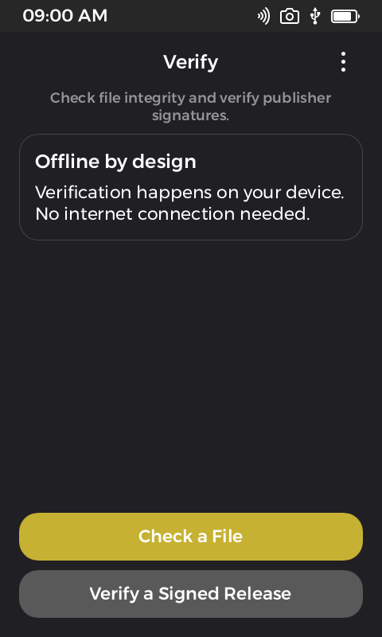
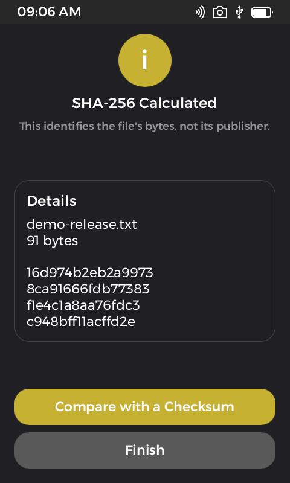
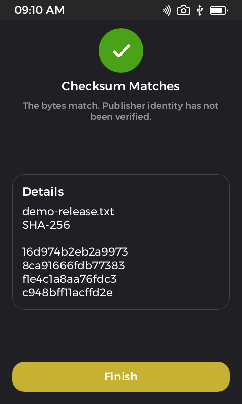
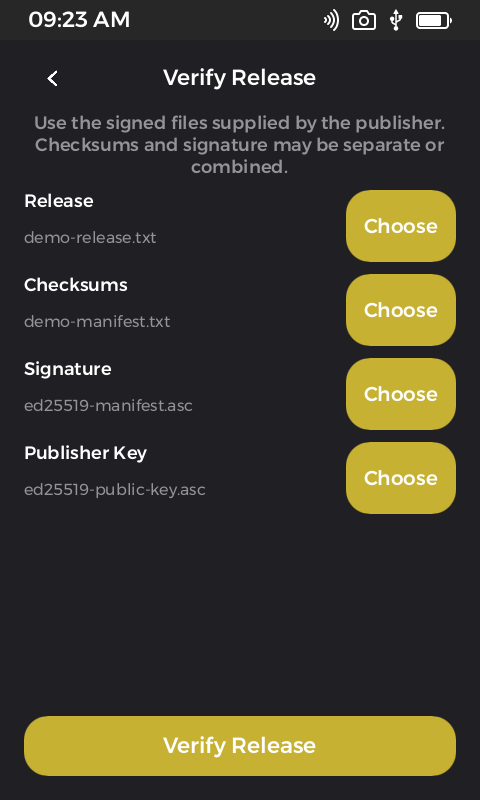
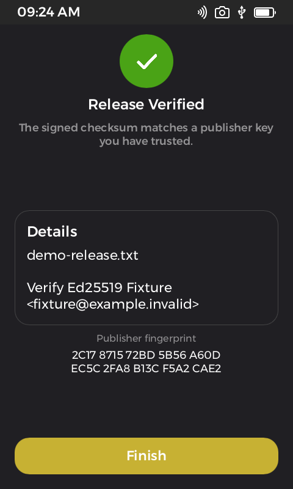
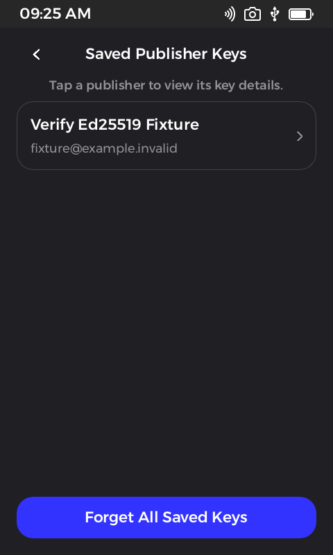
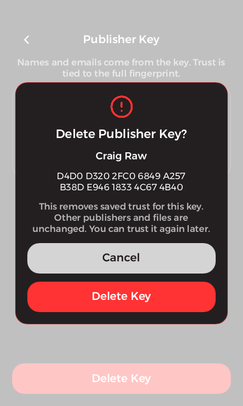

# Verify for Passport Prime

Verify checks file hashes and OpenPGP release signatures entirely on Passport Prime. It is designed for confirming that a downloaded file matches the bytes a publisher signed before you install, copy, or use it.

Verify is an open-source, third-party Foundation SDK app published by QnA. It is not Foundation-signed and has not received an independent security audit.



## What it does

- Calculates SHA-256 and SHA-512 hashes without loading the whole file into memory.
- Compares a file with GNU, BSD, or bare checksum files.
- Verifies detached OpenPGP signatures over checksum files.
- Verifies clear-signed OpenPGP checksum files.
- Verifies detached OpenPGP signatures made directly over release files.
- Supports binary signature bundles and consecutive armored signature blocks.
- Saves explicitly trusted publisher fingerprints and reusable public certificates on the device.
- Works with files from Internal storage, Airlock, SD cards, and USB storage through KeyOS file pickers.

Verify has no network access and cannot access the Passport master seed or Seed Vault. It never signs, decrypts, generates keys, installs software, or executes the files it checks.

## Screenshots

| Hash a file | Compare a checksum |
| --- | --- |
|  |  |

| Verify a release | Review the result |
| --- | --- |
|  |  |

| Saved publishers | Delete one publisher |
| --- | --- |
|  |  |

## Install

Verify 1.0.0 requires KeyOS 1.4.0-beta3 or newer.

1. Download these files from the [latest GitHub release](https://github.com/BitcoinQnA/keyos-verify/releases/latest):
   - `verify-1.0.0-beta3.app`
   - `qna-publisher.crt`
   - `SHA256SUMS.txt`
2. Confirm the downloads match `SHA256SUMS.txt`.
3. Independently compare the QnA publisher fingerprint before allowing the certificate:

   ```text
   1fc590a13d547db696e0d3cd12d07a4d7b119e957b301aedd1299b10a1852971
   ```

4. Copy the certificate and app package to an SD card, USB drive, or Airlock. Do not unpack the `.app` file.
5. On Passport, open **Settings > Apps**, allow the QnA publisher certificate, and carefully compare the fingerprint shown on the device.
6. Choose **Install App**, select `verify-1.0.0-beta3.app`, and follow the on-device confirmation.

Allowing a publisher permits apps signed by that certificate to run. The displayed QnA name and email are self-asserted; the full fingerprint is the identity to compare.

## Verify a release

Always choose the release file and publisher public key. Then select the other files supplied by the publisher:

| Publisher's release structure | Checksums | Signature |
| --- | --- | --- |
| Separate checksum and signature files | Select checksum file | Select detached signature |
| Clear-signed checksum file | Select clear-signed checksum | Leave empty |
| Signature directly over the release file | Leave empty | Select detached signature |

The selected public certificate must validate at least one acceptable signature in a bundle. Verify does not claim every signature is valid and does not enforce a multi-party signing threshold.

For a first-time publisher, compare the complete fingerprint with a value obtained through an independent trusted channel. Only then choose **Trust This Publisher Key**. A later release can reuse the saved public key from the publisher picker.

## Supported inputs

- SHA-256 and SHA-512.
- GNU `sha256sum`/`sha512sum` manifests.
- BSD `SHA256 (...) = ...`/`SHA512 (...) = ...` manifests.
- One bare hexadecimal digest.
- ASCII-armored and binary detached OpenPGP signatures.
- Clear-signed OpenPGP checksum files.
- RSA keys of at least 2048 bits and Ed25519 signing keys.
- Supplied key expiration and revocation information.

For signed-checksum workflows, the checksum entry must match the selected filename. Duplicate basename matches are rejected.

## Security boundaries

A matching hash proves only that two byte sequences match. A valid signature proves that a particular key signed those bytes. Neither result proves that the key belongs to the claimed person, that the software is safe, or that the release is current.

Verify cannot:

- discover a newly published revocation while offline;
- prevent a valid older release from being checked;
- guarantee that another computer later executes the exact file checked;
- verify Minisign, Sigstore/Cosign, compressed OpenPGP messages, or multi-key certificate bundles;
- validate every signer in a bundle or enforce a signing threshold.

Set the Passport clock correctly before checking time-limited keys or signatures. Read [SECURITY.md](SECURITY.md) for input limits, trust storage, dependency notes, and the complete threat model.

## Test files

The release includes `verify-1.0.0-test-files.zip`, containing public disposable fixtures for positive and negative tests. Never treat its demo keys as real publisher identities.

The automated suite covers signature and checksum success, tampering, wrong keys, weak algorithms, expiry, revocation, malformed packets, streaming, cancellation, saved-publisher persistence, package signatures, archive integrity, and UI regressions. See [TESTING.md](TESTING.md) for the release evidence.

## Build from source

Install the Foundation SDK using its [official getting-started guide](https://docs.foundation.xyz/developers/get-started/). This project uses the installed SDK bundle through `.foundation-sdk/current` and the signing identity selected in `app-config.toml`.

Inside the SDK development shell:

```sh
foundation doctor
cargo test -p verify-core
cargo clippy -p verify-core --all-targets -- -D warnings
cargo fmt -p keyos-verify -p verify-core -- --check
python3 -m unittest discover -s tests -p 'test_*.py' -v
bash scripts/check-ui.sh
foundation sim
```

Create the signed KeyOS beta3 package:

```sh
foundation pack --release --out target/verify-sdk-1.0.0.app
python3 scripts/pack-beta3.py target/verify-sdk-1.0.0.app dist/verify-1.0.0-beta3.app
VERIFY_PACKAGE=dist/verify-1.0.0-beta3.app \
  python3 -m unittest discover -s tests -p 'test_*.py' -v
```

## Support and license

Report bugs through [GitHub Issues](https://github.com/BitcoinQnA/keyos-verify/issues). Do not include private keys, recovery words, non-public files, or other secrets in a report.

Verify is available under the [MIT License](LICENSE).
